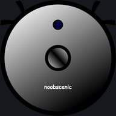
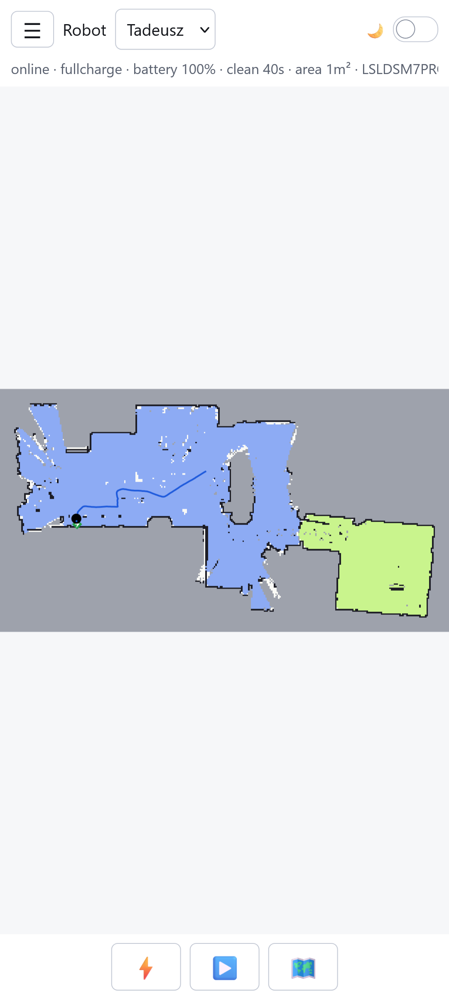
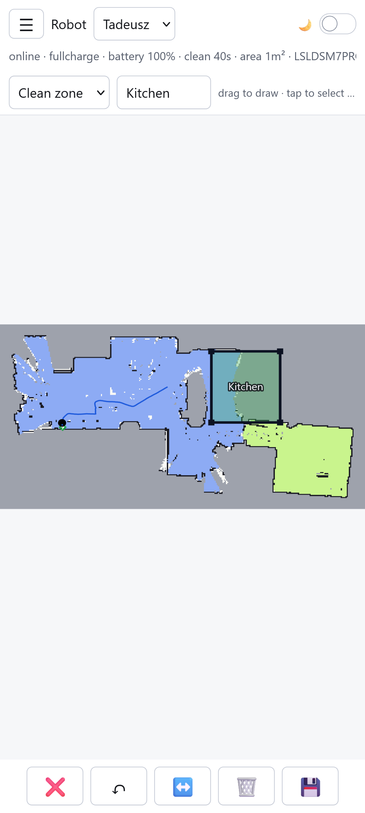

# noobscenic

A clean-room, reverse-engineered replacement server for the **Proscenic M7 Pro**
robot vacuum, written in Rust.

The goal is to re-home (pair) the robot to a server you control —
re-implementing the vendor cloud APIs and protocols — so it keeps working
without actually ever talking to the vendor cloud.

⚠️ The software assumes single household use and exposure to LAN only — it lacks
access control (authentication) or security features (HTTPS). **Run it exposed
to the internet at your own risk.** ⚠️

Status:
- ☑️ re-homing (pairing) works,
- ☑️ commands, robot responses, and telemetry all work,
- ☑️ maps, zones, paths - decoded, rendered, imported and exported,
- ☑️ SQLite persistent storage,
- ☑️ a web UI to control the robot.

ℹ️ *The web UI is run from the server itself and is mobile-friendly. No separate
mobile app is planned.*

 

## Usage guide

### What you need

- A machine (server) that is reachable from the robot's LAN and keeps the same
  address between sessions: a DHCP reservation, a static IP, or a DNS name. The
  robot is configured with this address and will keep dialing it.
- Rust (stable) to build the server; Python 3, standard library only, for the
  re-home tool.
- TCP ports **8080** (channel A) and **8081** (channel B) reachable from the robot.
  Check the firewall on the server machine.

All state lands in the data directory (`./var` by default): `noobscenic.db` (SQLite),
`traces/` (wire captures) and `logs/`.

### 1. Run the server

    cargo run -- --data-dir ./var

The server listens on `0.0.0.0:8080` and `0.0.0.0:8081`. Its stdin is an operator
console when it is a terminal — `help` lists the verbs, and `devices`, `events`,
`commands` and `send` are the ones you will use most. Logs go to stderr and to
`var/logs/noobscenic.log`. The same verbs exist as one-shot CLI commands
(`noobscenic devices`, `noobscenic send …`), which work from a second terminal and
share the database with the running server.

The same port also serves a small web UI: open `http://<server-address>:8080/` on
your phone or desktop and pick the robot in the top bar — the choice lands in the
URL (`?id=…`), so a robot is a bookmarkable page. The map redraws as the robot sends
telemetry, the last clean path is drawn over it, and the bottom bar sends the
argument-less commands (`smartClean`, `pause`, `continue`, `stop`, `findCharge`).
There is **no authentication**: anyone who can reach port 8080 can drive the robot.

To change settings, copy `config.example.json` to `config.json` (it is read from the
working directory; unknown keys are rejected). The interesting ones:
`gateway.encrypt_commands` (allows `encrypt:1` command encryption),
`logging.wire` (what gets captured), `http.bind` / `gateway.bind`, `console.enabled`.

### 2. Re-home (pair) the robot

1. Start the server first (above), then put the robot into pairing mode and join
   this machine to the robot's own open Wi-Fi — the network name begins with
   `Proscenic-`.

2. Run:

       python tools/rehome.py --server-host <server-address> \
           --ssid <target-wifi-ssid> --pwd '<target-wifi-password>' --userid <any-id>

   The tool finds the robot's UDP port, points its cloud URL and push gateway at
   `server-address`, arms the bind, stores the Wi-Fi credentials and commits the
   configuration. `--dry-run` prints the datagrams instead of sending them;
   `--port 7913` skips the port sweep on this model.

3. The commit disables the robot's soft-AP, so reconnect this machine to your normal
   Wi-Fi. The robot joins the target network and dials the server; the server never
   dials the robot.

### 3. Check that it worked

- The server log shows the channel-B handshake (`channel-B handshake; device online`).
- `devices` shows the robot `online`; `device <sn>` shows its session and, once the
  preBind has been answered, `bind state bound`.
- `events <sn> 5` shows the last things the robot said.
- Send something harmless: `send <sn> 21018 {}` (firmware version), then `commands` —
  the row should walk `pending` → `sent` → `acked` within a second or two.
- A whole cycle: `send <sn> 21005 {"mode":"smartClean"}` starts a clean,
  `send <sn> 21017 {"cmd":"stop"}` ends it, and `send <sn> 21012 {"cmd":"start"}`
  sends the robot home.

### 4. Normal use

Open the server address on port 8080 in a browser:

### Troubleshooting

If the rehoming tool reports no robot, check the robot is in pairing mode and
this machine is on the `Proscenic-` network, not still on its normal Wi-Fi.

If nothing reaches the server after the switch, check the firewall — a missing
inbound "allow" rule, or a "deny" rule, can drop the robot's packets silently.
The default ports are 8080 and 8081, TCP.

If the robot stops reaching the server later, its configured `server-address`
may have changed: use a DHCP reservation, a static address, or a DNS name.

### Backing out

- **Stop the server** — console `quit`, or Ctrl-C. The robot keeps working from its
  own panel; you lose the app-style control, telemetry and maps until it is re-homed.
- **Move it to another server**: re-run the re-home tool with the new address.
- **Hand it back to the vendor app**: put the robot back into pairing mode (its
  Wi-Fi reset; see the vendor manual) and re-add it with the app. The app's
  add-device flow re-provisions the cloud URLs and Wi-Fi the same way the re-home
  tool does; the binding noobscenic recorded lives only in `var/noobscenic.db`.
  Whether the vendor cloud accepts the device again depends on its own record — if
  re-adding is refused, a factory reset clears the robot side.
- **Forget everything we stored**: delete `var/`.

### Not yet implemented (perhaps deliberately postponed)

Protocol analysis and reverse-engineering artifacts live in [`doc/`](doc/).

Planned, but not a priority at the moment:

- Scheduled cleaning. Not a feature I ever used myself.
- Some robot settings, such as speaker volume, water pump strength are not
  exposed yet.
- `noobscenic trace <file>` — rendering a wire capture as a readable timeline.
  Cool, but not exactly necessary.
- `--replay` — feed a recorded capture back into a fresh server as a regression
  test. Same as above.
- TLS on the listeners — only useful for a DNS-override deployment that
  impersonates the vendor hostname. The robot validates no certificates, so a
  self-signed cert would do, and the re-homed path needs none of it.
- Exploit for uploading a homebrew firmware. Needs security research.

See [`doc/PLAN.md`](doc/PLAN.md) §14 for what these would look like.
